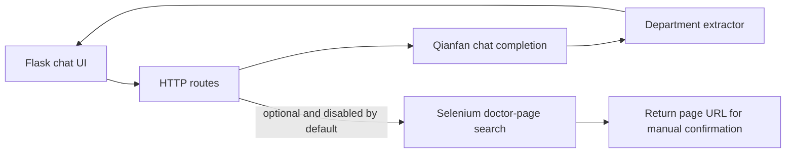

# Intelligent Medical Consultation Prototype

> **Earlier undergraduate course project, retained for record.**
>
> A course prototype that connects a Qianfan conversational model, department extraction, and an optional browser-assisted doctor-search workflow.

本项目来自山东大学（威海）数据科学实验班课程实践。它展示了一条完整但简化的交互链路：接收用户描述、调用大模型生成回复、从回复中提取候选科室，并在用户明确启用时，通过浏览器自动化寻找相关医生页面。

> **Safety boundary:** this repository is an educational interface prototype. It does not provide medical diagnosis, treatment advice, or a production appointment service. Users should consult qualified medical professionals and complete any appointment action themselves.

## Architecture



The code deliberately separates conversational inference from browser automation. The automation path is disabled by default and stops at a doctor-information page instead of confirming a real appointment.

## Repository structure

```text
.
├── app.py                       # development entry point
├── medical_agent/
│   ├── __init__.py              # Flask application factory
│   ├── booking.py               # optional Selenium workflow
│   ├── departments.py           # department vocabulary and extraction
│   └── routes.py                # HTTP endpoints
├── templates/chat1.html
├── static/
├── docs/course-notes/           # original course explanations
├── .env.example
├── .gitignore
└── requirements.txt
```

## Main interaction flow

1. The browser sends a short user message to `POST /chat`.
2. The backend calls the configured Qianfan model.
3. A conservative vocabulary matcher extracts department names from the generated reply.
4. The UI presents the response and retains the suggested department for the optional doctor-search action.
5. When browser automation is explicitly enabled, `POST /autoregister` searches for a relevant doctor page and returns its URL for manual review.

## Local setup

The project is retained primarily as an inspectable course artifact. A basic local setup is:

```bash
python -m venv .venv
# Windows: .venv\Scripts\activate
# macOS/Linux: source .venv/bin/activate
pip install -r requirements.txt
```

Copy `.env.example` to `.env`, then provide your own Qianfan credentials:

```text
QIANFAN_ACCESS_KEY=replace-me
QIANFAN_SECRET_KEY=replace-me
```

Start the Flask development server:

```bash
python app.py
```

The chat page is available at `http://127.0.0.1:5000`.

## Optional browser workflow

Browser automation is off by default. To inspect the historical Selenium workflow, set:

```text
BOOKING_AUTOMATION_ENABLED=true
BOOKING_SEARCH_URL=https://example.com/doctor-search
```

The real target page, selectors, browser version, and website policy may have changed since the original course demonstration. Review and update them before any controlled test. The code does not click a final appointment-confirmation button.

## Dependencies and external systems

- Flask serves the page and JSON endpoints.
- Qianfan provides the conversational completion API.
- Jieba performs simple Chinese vocabulary matching.
- Selenium drives the optional browser handoff.
- The frontend uses the original HTML/CSS/jQuery course interface recovered from the project archive.

## What this prototype demonstrates

- integration of an external language-model API into a small web application;
- rule-based extraction after model generation;
- a clear boundary between conversational output and external side effects;
- packaging of the original page, backend, and course documentation as normal source files rather than a binary ZIP.

## Known limitations

- Each `/chat` request is independent; durable multi-turn dialogue state is not implemented.
- Department extraction uses a fixed vocabulary and may miss synonyms or return an unsuitable department.
- Model output is unverified and must not be treated as medical advice.
- Browser selectors are brittle and depend on a third-party website.
- There are no automated tests or stable offline fixtures for the external services.

## Historical notes

The detailed Chinese explanations from the original submission are preserved in [`docs/course-notes`](docs/course-notes). The former `chat.zip` and bundled EdgeDriver have been removed from the public source layout; the recovered templates and static assets now live in their standard Flask directories.

